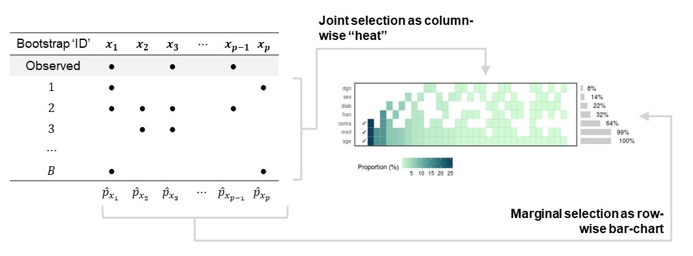
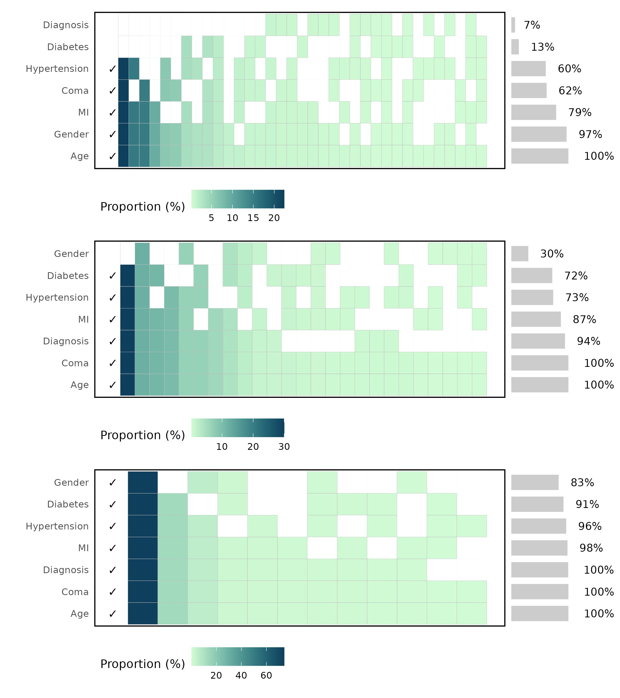

# {tetrisplot}

## About

Data-driven variable selection (e.g., stepwise selection) typically involve conditional decisions that complicate inference yet invite a 'one-true model' interpretation. Issues with this approach are well documented in the scientific literature [Harrell, 2015; Steyerberg, 2009]:

-   Biased parameter estimates ('testimation' bias)
-   Confidence intervals are too narrow; $p$-values are exaggerated; model $R^2$ is biased large
-   Detaches thought from selection risking the nonsensical removal of clinically (or subject matter) relevant variables

Despite these known issues, their application persists in published analyses of clinical data [Zamanipoor et al., 2020]. If care is not taken, incorrect variable 'selections' are perpetuated into future hypotheses, consequently wasting effort & resource. An effective way of representing the model uncertainty induced by variable selection is to consider the long run frequency of variables selected when applied to a sufficient number of bootstrap samples drawn from the original training-set. Strong (not necessarily real!) "outcome-predictor" effects will typically come through in the majority (or all) of the bootstrap fits. A number of known predictors might then be expected to appear "typically" in the final fit, but there are no guarantees. Bootstrap sampling can be used here to emulate the natural perturbations that might have occurred when originally collecting our data: summarising the impact of such perturbations on the final model can be a powerful and insightful way to explore this problem, particularly when conveying this message to our non-quantitative colleagues [Heinze et al., 2018].

Here we introduce the 'Tetris plot' and the associated `{tetrisplot}` package as a way of visualising this instability.

## Installation

The development version of the `{tetrisplot}` package can be installed from our [GitHub repo](https://github.com/GSK-Biostatistics/tetrisplot) using the following `devtools` command:

```         
devtools::install_github("GSK-Biostatistics/tetrisplot")
```

## Inspecting model (in)stability and novel ways to present this

In their 2018 paper, Heinze *et al.* outlined how it was possible to empirically estimate marginal and joint variable selection probabilities by repeatedly applying any data-driven selection steps over 100's of re-sampled bootstrap draws (with replacement) from the sample data. The intuition here is that there is value in leveraging the variable selection uncertainty (and therefore model uncertainty) implicit across bootstrap re-samples.

The table in Figure 1 illustrates the bootstrap selection across a set of $p$ candidate covariates, $x_i$ with $i=1, 2, \dots, p-1, p$. 
The $x_i$ variable has inclusion probability $p_{x_i}$ estimated by averaging a column-wise indicator over the total bootstrap samples, $B$. 
There exists a set of $2^{p+1}$ unique combinations of selected $x_i$ variables (including an intercept only model). However, given the data, the model, and the selection criteria, not all of these are equally likely. The observed frequency of the unique joint combinations out of the $B$ draws can be derived to expose this.


 
The 'Tetris plot' therefore aims to bring the bootstrap results to life, acting as a visual representation of the dangers that lurk when reifying the observed final data-driven selection.

## Example

Using the data available in the `{tetrisplot}` package we now illustrate some output visualisations under a few of the available selection methods implemented in the package.

```{r eval=FALSE}
data(iswr_stroke)

vec <- colnames(iswr_stroke)[colnames(iswr_stroke) != "dead12"]

boot_dat <- bootstrap_data(iswr_stroke, 
                           times = 100)

boot_univariate <- analyse_univariate(boot_dat,
                                      response = "dead12",
                                      vars = vec, 
                                      family = "binomial", 
                                      level = 0.05)

boot_backward <- analyse_backward(boot_dat,
                                  response = "dead12",
                                  vars = vec, 
                                  family = "binomial")

boot_lasso <- analyse_grlasso(boot_dat,
                              response = "dead12",
                              vars = vec, 
                              family = "binomial",
                              grpreg_list = list(penalty = "grLasso"))


```
A simple call to the associated `plot()` method for each of the outputs 


## References

Dalgaard, P. (2020). ISwR: Introductory Statistics with R. R package version 2.0-8

Harrell, F. E. (2015). Regression Modeling Strategies: With Applications to Linear Models, Logistic and Ordinal Regression, and Survival Analysis. Springer International Publishing

Heinze, G., Wallisch, C., & Dunkler, D. (2018). Variable selection -- A review and recommendations for the practicing statistician. Biometrical Journal, 60(3), 431--449. <https://doi.org/10.1002/bimj.201700067>

Steyerberg, E. W. (2009). Clinical Prediction Models: A Practical Approach to Development, Validation, and Updating. Springer International Publishing

Zamanipoor Najafabadi, A. H., et al. (2020). TRIPOD statement: A preliminary pre-post analysis of reporting and methods of prediction models. BMJ Open, 10(9), 1--10. <https://doi.org/10.1136/bmjopen-2020-041537>
